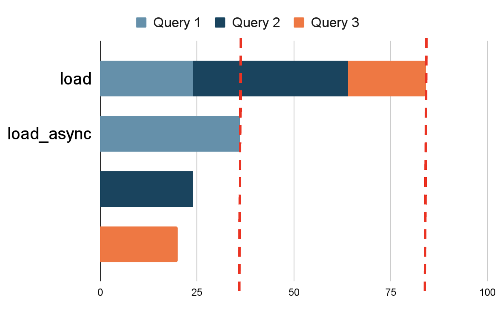

# Load Async


*Image by Pawel Urbanek.*

## **Horizontal Scaling of Database Operations**

Starting with Rails 7, we can use queries asynchronously. This is great because, although each query would take the same time individually, running multiple queries simultaneously on different threads reduces the total expected time to that of the longest query.


*Image by Nicolás Falconi.*

As shown in the graph, we reduced the total time for a series of three hypothetical queries to approximately one-third of the original duration.

### **How to Use Them?**

```ruby
# Standard synchronous query
users = User.where(active: true).load

# Asynchronous query
users = User.where(active: true).load_async
```

## **Use Cases**

### Fetching Data in Parallel

Fetch multiple data sets in parallel, scaling database operations horizontally.

```ruby
# Fetching data asynchronously
active_users = User.where(active: true).load_async
inactive_users = User.where(active: false).load_async

# Using the fetched data
puts "Total Active Users: #{active_users.size}" # Forces the query to complete
puts "Total Inactive Users: #{inactive_users.size}"
```

### Aggregating data

Use fetched data to aggregate data .

```ruby
# Fetching data
active_users = User.where(active: true).load_async
inactive_users = User.where(active: false).load_async

# Calculating metrics
total_users = active_users.size + inactive_users.size
active_percentage = (active_users.size.to_f / total_users * 100).round(2)
```

### **Parallelize Expensive Queries**

Combine load_async with non-database operations to make the most of the time while waiting for queries to complete.

```ruby
users = User.where(active: true).load_async
perform_some_heavy_computation
puts "Users: #{users.size}" # Forces query resolution
```

### **Lazy Loading in Views**

Pass async queries directly to views. Rails will fetch the data only when accessed, keeping things efficient

```ruby
#controller 
class DashboardController < ApplicationController
  def index
    @active_users = User.where(active: true).load_async
    @published_posts = Post.where(published: true).load_async
  end
end

# view
<h1>Dashboard</h1>

<p>Total Active Users: <%= @active_users.size %></p>
<p>Total Published Posts: <%= @published_posts.size %></p>

<h2>Active Users</h2>
<ul>
  <% @active_users.each do |user| %>
    <li><%= user.name %></li>
  <% end %>
</ul>

<h2>Published Posts</h2>
<ul>
  <% @published_posts.each do |post| %>
    <li><%= post.title %></li>
  <% end %>
</ul>
```

**Note:**
Avoid calling the query multiple times. Don't access the same lazy-loaded relation repeatedly.

```ruby
<p>Total Active Users: <%= @active_users.size %></p>
<p>First User Name: <%= @active_users.first.name %></p> <!--
```

Instead keep it on a variable so it doesn’t load multiple times.

```ruby
<% active_users = @active_users.to_a %>
<p>Total Active Users: <%= active_users.size %></p>
<p>First User Name: <%= active_users.first.name %></p>
```

## Extras

### **Order matters**

The puts statement will execute even if posts are not yet loaded. The order in which we access the information can affect the performance of our operations.

```ruby
# Async queries
users = User.where(active: true).load_async
posts = Post.where(published: true).load_async
comments = Comment.where(approved: true).load_async

puts "Users: #{users.size}"       # Resolves first, does not wait for posts
puts "Posts: #{posts.size}"       # Resolves second, does not wait for comments
puts "Comments: #{comments.size}" # Resolves third
```

### What about I don’t want to  wait for all the things to load?

Remember that this will take as long as the slowest query in the set. However, let's say you want to execute multiple tasks in parallel, inspired by the asynchronous approach that load_async introduced. Here's how you might do that:

```ruby
results = []

threads = []
threads << Thread.new { results << { name: "Users", count: User.where(active: true).load.size } }
threads << Thread.new { results << { name: "Posts", count: Post.where(published: true).load.size } }
threads << Thread.new { results << { name: "Comments", count: Comment.where(approved: true).load.size } }

# Wait for all threads to complete
threads.each(&:join)

# Print results as they complete
results.each do |result|
  puts "#{result[:name]}: #{result[:count]}"
end
```

In this case:
• Each query runs independently in its thread.
• The results are added to the results array as soon as they finish.
• The output order depends on which query completes first.

This is reminiscent of Promise.all() from JavaScript.

## Are there more async methods? YES

There are many methods that can be used asynchronously since versipon v7.1.3.2.

- `async_count`
- `async_sum`
- `async_minimum`
- `async_maximum`
- `async_average`
- `async_pluck`
- `async_pick`
- `async_ids`

```ruby
# Synchronous count
irb(main):001> User.count
  User Count (58.7ms)  SELECT COUNT(*) FROM "users"
=> 53

# Asynchronous count
irb(main):002> promise = User.async_count
  User Count (3.6ms)  SELECT COUNT(*) FROM "users"
=> #<ActiveRecord::Promise status=complete>
irb(main):003> promise.value
=> 53
```

Please use them!

## References

- <https://pawelurbanek.com/rails-load-async#load-async-explained>
- <https://api.rubyonrails.org/classes/ActiveRecord/Relation.html#method-i-load_async>
- <https://blog.saeloun.com/2023/11/21/rails-7-1-expands-active-record-async-quries/>
- <https://www.shakacode.com/blog/rails-7-1-active-record-api-for-general-async-queries/>
- Chatgpt for examples
